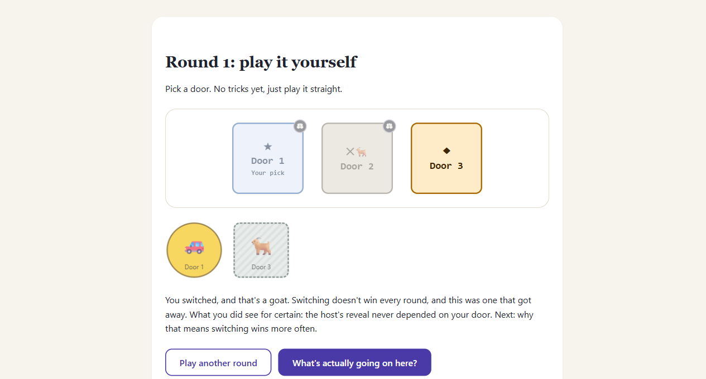
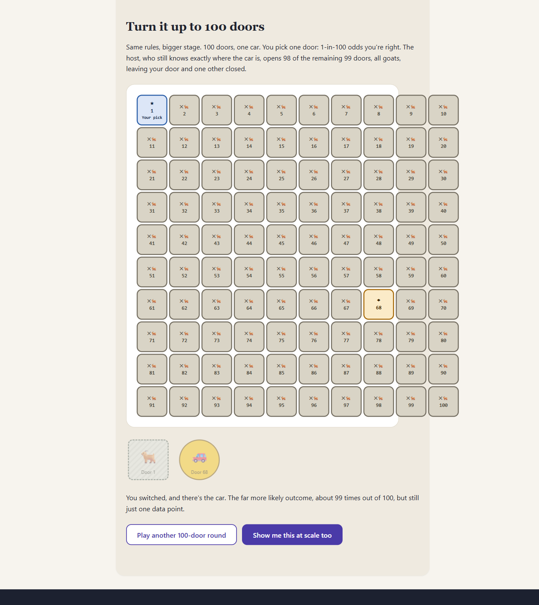
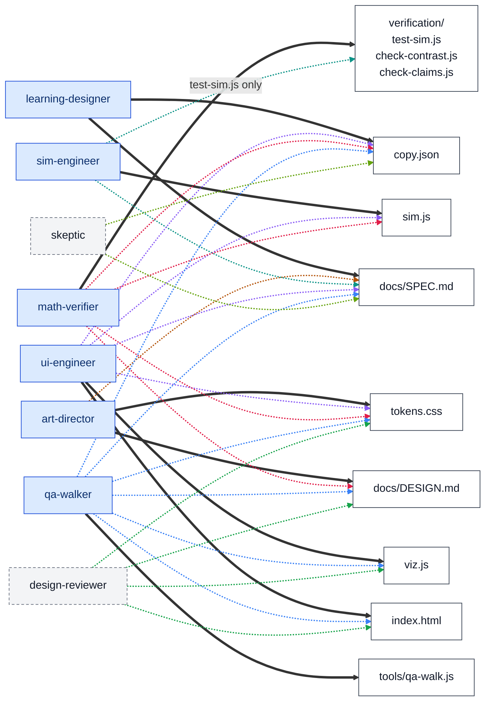
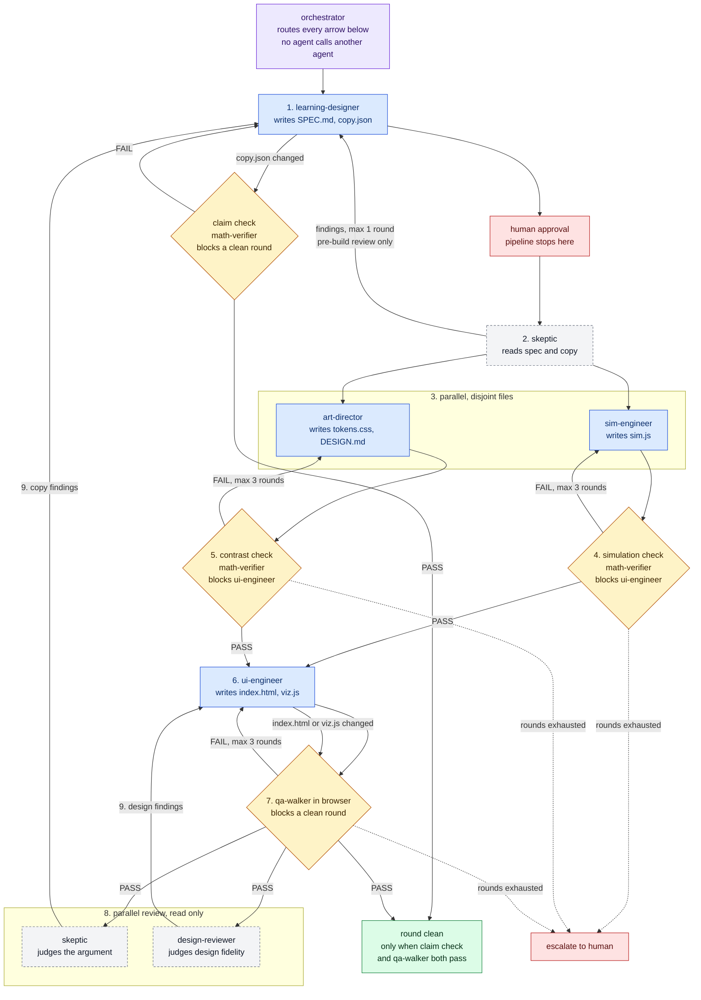

# Agent Software Factory

**TL;DR:** This is a report on running an eight-agent Claude Code pipeline,
with separate roles, exclusive file ownership, and independent verification,
end to end to find out how a multi-agent build actually behaves in
practice, using a Monty Hall explainer as the test case. First full run:
$31.81 API-equivalent, with only 51% of that usage attributed to named
subagents and the other 49% not attributed to anything. Coordination
overhead in the orchestrator's own context is the likeliest explanation,
but the reported numbers do not establish it. That bought nine real bugs the
pipeline caught, three of which no single-session build would have
surfaced. A human walkthrough of the finished page afterwards found four
more defects that all four verification layers had passed. To look
further: open `index.html` for the page, read `CLAUDE.md` and
`.claude/agents/` for the pipeline, read `docs/LESSONS.md` for the
generalized rules.

[Open the live demo](https://gabriel-dg.github.io/agent-software-factory/) to try the built explainer in your browser, nothing to install.

## The experiment

The question: does a role-separated agent team with independent
verification catch things a single session does not, and what does that
cost relative to one session doing the same work? Monty Hall was chosen as
the test case because its answer is settled by simulation rather than
opinion, so when two reviewers disagree, a script can decide it instead of
an argument. The answer: yes, the pipeline caught real bugs a single pass
plausibly would have missed, including three that needed a specific kind of
cross-checking no single session performs. It cost several times what a
single well-prompted session would have cost for a comparable page, and
that is not a marginal overhead, it is the headline result.

This repository contains the pipeline definition, [`CLAUDE.md`](CLAUDE.md)
and the eight agent definitions in [`.claude/agents/`](.claude/agents/), and
the Monty Hall explainer it produced. Where a claim about the odds carries
a machine-readable assertion, that assertion is checked by code against a
real simulation, and every color pair the page renders is checked against a
computed WCAG contrast ratio rather than asserted in prose. The assertions
themselves are the part a human still has to get right: the checker compares
the simulation to the assertion, never to the sentence the reader sees.

To run it: visit the [live demo](https://gabriel-dg.github.io/agent-software-factory/), or clone the repo and open `index.html` in a browser. No build step, no server, no npm install required for the page itself.





## The team

Eight agents, each with exclusive write access to a fixed set of files and a
narrow job description. No agent edits a file it doesn't own; an agent that
needs a file changed reports the problem and the orchestrator routes it to
whichever agent does own that file.



Thick solid arrows are exclusive write access. Exactly one agent points at
each file, and no other agent may change it. Dotted arrows are reads, colored
by the agent they leave so they can be followed across the crossings. skeptic
and design-reviewer have no write arrow at all, which is the whole point of
them; math-verifier and qa-walker write only their own harness files and read,
never write, every file they check. learning-designer is the only agent with
no read arrow: it starts the pipeline, and its definition lets it read
anything for context without naming a specific input.

| agent | model | tools | owns (exclusive write) | role |
|---|---|---|---|---|
| [learning-designer](.claude/agents/learning-designer.md) | sonnet | Read, Write, Edit | `docs/SPEC.md`, `copy.json` | Writes the pedagogical spec and every user-facing string. Decides what the page must teach and prove, not how it's built. |
| [art-director](.claude/agents/art-director.md) | sonnet | Read, Write, Edit | `tokens.css`, `docs/DESIGN.md` | Defines the visual design system as CSS custom properties only, and documents every text/background contrast pair with a claimed ratio. |
| [sim-engineer](.claude/agents/sim-engineer.md) | sonnet | Read, Write, Edit | `sim.js` | Writes the pure simulation logic (no DOM) that the page's claims are checked against. |
| [math-verifier](.claude/agents/math-verifier.md) | haiku | Read, Write, Bash | `verification/test-sim.js`, `verification/check-contrast.js`, `verification/check-claims.js` | Runs three independent numeric checks and reports PASS/FAIL with raw numbers only. Never comments on style, wording, or code quality. |
| [ui-engineer](.claude/agents/ui-engineer.md) | sonnet | Read, Write, Edit | `index.html`, `viz.js` | Builds the actual page and interactions from the spec, copy, tokens, and sim.js's exported functions. |
| [qa-walker](.claude/agents/qa-walker.md) | sonnet | Read, Write, Bash | `tools/qa-walk.js` | Drives the built page in a real Chromium browser via Playwright and checks it against the spec's beat sequence. Read-only on the explainer itself. |
| [skeptic](.claude/agents/skeptic.md) | opus | Read | nothing | Role-plays a reader convinced the odds are 50/50 and reports the exact sentence where the argument loses them. Read-only; suggests no code. |
| [design-reviewer](.claude/agents/design-reviewer.md) | sonnet | Read | nothing | Reviews the built page against `DESIGN.md` and `tokens.css` for implementation fidelity. Read-only; does not judge the argument or the copy. |

## The pipeline



Solid blue nodes write files and are the only agents that can. Dashed grey
nodes are read-only and produce findings, never edits. Yellow diamonds are the
four verification gates, run by math-verifier and qa-walker, neither of which
may edit the files it checks. Red is where the pipeline hands control back to
a human. Every arrow is the orchestrator making a routing decision; the agents
have no channel to each other.

The full sequence, from `CLAUDE.md`:

1. learning-designer produces `SPEC.md` and `copy.json`. **Stops for human
   review before anything else runs.**
2. skeptic reviews `SPEC.md` and `copy.json` alone, before anything gets
   built. Findings route back to learning-designer. Max one revision round,
   then the pipeline continues regardless. That limit is per phase, not per
   project: it caps this pre-build review only and does not cap the
   post-build review rounds in step 8. skeptic ran four times in the
   reference run, once here and three times over the built page, which is
   why `docs/SPEC.md` records four skeptic passes.
3. art-director and sim-engineer run in parallel (they own disjoint files,
   so there's nothing to merge).
4. math-verifier runs the simulation check. On FAIL, back to sim-engineer.
   Max three rounds, then escalate to the human.
5. math-verifier runs the contrast check on `tokens.css` and `DESIGN.md`. On
   FAIL, back to art-director. Max three rounds, then escalate.
6. ui-engineer builds `index.html` and `viz.js`, but only after both the
   simulation check and the contrast check pass.
7. qa-walker drives the built page in a real browser. On FAIL, back to
   ui-engineer. Max three rounds, then escalate.
8. skeptic and design-reviewer run in parallel over the finished page.
9. skeptic's findings route to learning-designer. design-reviewer's findings
   route by the file the fix lands in: markup and wiring to ui-engineer,
   token values and anything in `DESIGN.md` to art-director. A qa-walker
   ledger mismatch routes by cause: a pair the design never intended is
   ui-engineer's, a pair the design intends but `DESIGN.md` never declared is
   art-director's.
10. Any change to `sim.js` re-triggers the simulation check. Any change to
    `tokens.css` or `DESIGN.md` re-triggers the contrast check. Any change
    to `copy.json` re-triggers the claim check. Any change to `index.html`
    or `viz.js` re-triggers qa-walker. A skeptic/design-reviewer round is
    not considered clean until the claim check and qa-walker both pass
    again.

Writers run sequentially except where the pipeline explicitly parallelizes
them (step 3, step 8). Reviewers always run in parallel with each other.
Nothing gets implemented, fixed, or rewritten in the orchestrator's own
context; everything is delegated to the agent that owns the relevant file,
or escalated to the human when a round limit is hit.

## Verification

Four independent layers check different things and none of them substitutes
for another. All commands run from the repo root.

**1. Simulation correctness against analytic ground truth.**
```
node verification/test-sim.js
```
Runs `sim.js`'s `playRound`/`runTrials` over tens of thousands of trials and
compares the empirical win rate to the known closed-form answer (3 doors:
1/3 vs 2/3; N doors with N-2 revealed: 1/N vs (N-1)/N; random host: about
1/3 of rounds end in the prize being revealed, and among the rest, staying
and switching are 50/50). This catches a wrong simulation, something that
runs without error and produces plausible-looking numbers, but implements
the host's constraint incorrectly.

**2. Computed contrast ratios against the design ledger.**
```
node verification/check-contrast.js
```
Parses the literal colors in `tokens.css` and the declared pairs in
`docs/DESIGN.md`'s `## Contrast pairs` section, computes the real WCAG 2.1
relative-luminance ratio for each pair, and checks it against both the
required threshold and the ratio `DESIGN.md` claims. This catches a color
pair that was eyeballed as "looks fine" but fails AA, or a documented ratio
that's gone stale after a token value changed.

**3. Declared assertions in the copy against the simulation.**
```
node verification/check-claims.js
```
A string in `copy.json` that states a number may carry a sibling `_assert`
object naming `doorCount`, `hostMode`, `metric`, `expected` and
`tolerance`. This script runs the simulation with a fixed seed and checks
that the simulation's output for that metric lands within `tolerance` of
`expected`. It also runs a mechanical style pass over every string for em
dashes, en dashes standing in for em dashes, and malformed or unrecognized
`{{placeholder}}` tokens.

Be precise about what that does and does not establish, because it is easy
to read as more than it is. The script never parses the number written in
the sentence. It compares the simulation to the assertion, and the only
thing connecting the assertion to the sentence beside it is the intent of
whoever wrote both. A sentence can be edited into saying something else
entirely and the check still passes, as long as the `_assert` object is
untouched. The relationship is not even always equality:
`round100.mechanismCallout` tells the reader blind luck pulls this off
"only about 1 time in 50, roughly 2%" and its assertion is `prizeRevealed`
with `expected` 0.98, the complement. Both are correct, and a human has to
know that to know they are.

Coverage is partial, and nothing reports the gap. Counting strings that
contain a fraction, an "N in N" or "N of N" phrase, or a percentage, 36
strings in `copy.json` state a probability and 19 of them carry an
assertion. The 17 that do not include all six route rows and both worked
divisions in the two `whyYourDoorDoesntMove` tables, which is to say every
joint probability and the entire renormalization, the most mathematically
load-bearing arithmetic on the page. None of it is checked by anything but
a human reading it. So this layer catches a stated `expected` drifting away
from what the simulation produces; it does not catch a wrong number in the
copy, and it cannot tell anyone that a claim was never annotated in the
first place.

**4. Real-browser behavior via Playwright.**
```
cd tools && npm install
node qa-walk.js
```
(or `node tools/qa-walk.js` from the repo root, after `npm install` inside
`tools/`.) Drives the actual page end to end in a visible Chromium window:
loads it, plays through every beat, and checks for things no source review
can see, `sim.js` failing to load, the embedded copy JSON failing to parse,
an unsubstituted `{{placeholder}}` literally rendering to the reader,
content leaking before its triggering interaction. It then walks every
element in the rendered DOM, resolves its actual computed foreground and
background color, and checks that pair against `DESIGN.md`'s ledger. This
is the only layer that can catch a rendered color pair nobody ever declared
or verified, since check-contrast.js only ever checks pairs `DESIGN.md`
claims exist. It caught exactly that bug twice in this project (below).

## What the pipeline actually found

These are bugs an earlier pipeline stage, or a human skimming the same
text, plausibly would not have caught, because each one reads as correct on
a casual pass and only breaks under a specific kind of scrutiny.

These are the evidence for the answer given above, and they are specific to
this domain on purpose. The count is one bug per defect in the shipped page
or its spec that somebody had to go back and fix. The nine below are the ones
the pipeline's own agents and checks surfaced; the four in the next section
are the ones it did not. `docs/LESSONS.md` uses the same count and the same
definition.

- **A false general law stated as if it were a proof.** An early draft
  explained why the host's reveal doesn't update your own door's odds with
  "an event that was going to happen either way can't be evidence about
  which way it actually is." That sentence sounds right and is false: a
  host who, when he has a free choice between two goat doors, always favors
  the lower-numbered one, is still "certain either way" to reveal a goat,
  and yet which door he opens now leaks real information. skeptic's second
  pass found this specific counterexample; the fix replaced the false
  general law with the narrower, correct one (the host breaks ties
  uniformly at random) and stated that assumption explicitly everywhere the
  argument depends on it.
- **A silently dropped case in a three-case enumeration.** The argument
  compared what happens if you started on the car versus the other goat,
  and never mentioned the third starting case at all, "you had the goat
  behind the door that actually got opened." Omitting it reads exactly like
  the dropped-case trick the page exists to disprove. skeptic's third pass
  caught it; the fix adds the third route back explicitly, with its
  zero-probability reasoning stated as a direct consequence of the rule,
  not just asserted away.
- **Unrenormalized probabilities that summed to 1/2, not 1**, in the same
  three-case argument, with no stated justification for why only two routes
  were "live" or why dividing by their sum rather than by 1 was correct.
  Fixed by adding the actual joint-probability arithmetic instead of
  presenting the ratio as self-evident.
- **A claim asserted without demonstration.** The page stated that a
  knowing host and a random host can produce identical visible evidence
  while implying different answers, without ever showing it. The fix added
  a second, parallel probability table for the random host so the
  divergence is a worked calculation, not an assertion.
- **A wrong direction on a claim about the simulation.** A later draft
  described spoiled rounds (where a random host accidentally reveals the
  prize) as "disproportionately" the rounds switching would have won,
  hand-waving past the actual mechanism. Checking directly against `sim.js`
  showed the real relationship is exact, not approximate: when the player
  started on the car, a random host can never spoil the round; when the
  player started on a goat, he spoils it exactly half the time. Every
  spoiled round is a round switching would have won; none is a round it
  would have lost.

  This entry was wrong until the external review. It previously ended "the
  fix states this as the actual mechanism," and the fix had been applied to
  one string, `mechanismContrast.takeaway`, and not to the other,
  `faq.items[2]`, which still read "disproportionately" on the shipped page.
  So this README reported a completed fix that the live page contradicted,
  for as long as the entry stood. The external review caught the surviving
  instance; cross-checking the review against the repository confirmed it;
  the FAQ string has since been corrected too. No verification layer found
  it, and none could have: `check-claims.js` compares the attached assertion
  to `sim.js` and never reads the sentence.
- **A design fix that quietly removed a requirement.** When design-reviewer
  flagged that a door-eligibility badge misused a color family reserved for
  "you can click this," art-director's first proposed fix was to drop the
  badge and replace it with generic disabled-button styling. That styling
  communicates "not clickable," not the actual game-logic fact the badge
  existed to convey (this door was structurally forbidden to the host).
  Nothing downstream would have caught this on its own, since the page
  would still run, still pass every numeric and contrast check, and look
  reasonable; catching it required a human reading the proposed fix against
  what it was supposed to preserve, and sending it back.
- **A visual state that collided with an existing one.** design-reviewer
  found that the same lock icon and the same violet color family used
  page-wide to mean "you can click this" had been reused for a door that
  was explicitly not clickable, and separately found a "played vs. spoiled"
  round pair distinguished only by two very similar shades of pale orange,
  which breaks the page's own rule that no state pair is color-only. Both
  needed a real design decision (new token families, shape and border
  differences), not a code patch.
- **An undeclared color pair that only existed at render time.**
  check-contrast.js only checks pairs `DESIGN.md` claims exist; it has no
  way to know what the actual page renders. Twice in this project,
  qa-walker's browser-level check found a text/background pair on the live
  page that had never been declared or verified, once from an inherited
  background nobody traced through the cascade, once from a legend label
  that picked up its container's background instead of its own. Neither
  check-contrast.js nor a source-code read would have caught either, since
  both require resolving inherited styles the way a browser actually does.
- **A style rule that the responsible agent got wrong about its own work.**
  A compression pass was explicitly required to leave zero em dashes in
  `copy.json`, and the agent that did the pass reported back that it had.
  It had not; ten remained, found only by a manual grep from the
  orchestrator, not by any automated check. This is why the style pass
  described in the verification section above exists now, specifically
  because the pipeline had a real gap here and closing it meant adding a
  fourth kind of check, not just re-trusting the same self-report.

## What the pipeline missed

The pipeline reported all four verification layers green: the simulation
check, the contrast check, the claim check, and qa-walker's browser walk. A
human then opened the built page and walked it as a reader would, and found
four more defects. Three of them had qa-walker's PASS on them at the time.

- **The footer was never gated.** Every teaching beat on the page is hidden
  until the reader unlocks it, but the footer had no gating of its own, so it
  collapsed upward and rendered directly under the first poll. The reader saw
  the host-knowledge rule and the colophon before answering the opening
  question. The root cause is that the footer was never in `SPEC.md`, so
  qa-walker's "nothing visible before its trigger" check had no entry for it.
- **The door ineligibility badge marked the wrong doors.** Its class was
  `door-ineligible-interaction` and it was applied to the player's picked door
  and to the door the host had opened, meaning "not clickable", not "the host
  was structurally forbidden from opening this". It was never applied to the
  car's door. It therefore contradicted the callout rendered directly below
  it, which read that the host skipped the player's door and the car's door.
  qa-walker passed it because its assertion checked that the badge did not
  spoil the round, not that it marked the doors the copy claimed.
- **The badge was invisible to assistive technology.** It contained no text,
  no `title` and no `aria-label`, and its only icon was `aria-hidden`. An
  explicit instruction that any icon carrying meaning must not be
  `aria-hidden` had been given, and was not caught by any check.
- **The colophon's repository URL was plain text.** The footer contained no
  anchor element at all, so the one link the page existed to offer could not
  be clicked.

Every one of these is the same failure shape as the bugs the pipeline did
catch: a verifier checking correctly against a specification that does not
mention the thing being checked. The pipeline never validates that its own
specification is complete, and no layer in it can. The nine bugs listed under
"What the pipeline actually found" are therefore the count of defects the
pipeline found, not the count of defects that existed.

## What it cost

These numbers cover the first end-to-end run only, spec through the first
complete verification pass, not the later compression and design-review
rounds described above. They come from a Claude Pro plan; the dollar figure
is the API-equivalent cost, not what was actually billed under the plan,
and this run exhausted the plan's usage window and drew on additional
credits beyond it.

- API-equivalent cost: $31.81.
- API duration: 2h 23m. Wall-clock duration: 17h 24m.
- Code changes: 6,238 lines added, 514 removed.

By model:

| model | cost | share | input | output | cache read | cache write |
|---|---|---|---|---|---|---|
| Sonnet | $29.41 | 92% | 677.2k | 796.1k | 48.8m | 3.6m |
| Opus | $1.87 | 6% | 94.4k | 24.3k | 243.1k | 106.7k |
| Haiku | $0.53 | 2% | 10.6k | 39.2k | 984.3k | 179.8k |

Share of total usage by subagent, as reported by Claude Code: learning-designer
16%, qa-walker 15%, ui-engineer 9%, art-director 6%, skeptic 3%,
design-reviewer 1%, math-verifier 1%. Those are seven figures for eight
agents: sim-engineer does not appear in the list at all. They were reported
as individual characteristics of usage, not as a partition of it, so they
carry no guarantee of summing to 100%. They sum to 51%.

What consumed the other 49% is not something these numbers answer. The
hypothesis they are consistent with is that the orchestrator's own context
accounts for much of it: 42% of total usage happened at over 150k tokens of
context, and a long-running coordinator accumulates context from every
delegation, every routing decision, and every status check, none of which
is free just because it isn't a subagent call. But sim-engineer's missing
share sits in that same 49%, and nothing in the source data splits it. Read
coordination overhead here as a hypothesis the numbers permit, not as a
measurement.

The honest comparison: a single well-prompted Claude Code session would
have built a page like this for a small fraction of that cost. What the
extra cost bought is the bug list above, not a better-looking page.

## How to reproduce something similar

Setup:

1. Clone the repo. The explainer itself (`index.html`, `sim.js`, `viz.js`,
   `tokens.css`, `copy.json`) needs nothing installed; open `index.html`
   directly.
2. For verification, you need Node.js on your machine (no specific version
   is pinned in this repo).
3. For the browser-driven check, `cd tools && npm install`. Installing the
   `playwright` package is supposed to download the Chromium build it needs
   automatically. In practice, on this machine that didn't happen, so if
   `node qa-walk.js` can't find a browser afterward, run
   `npx playwright install chromium` inside `tools/` as an explicit
   fallback.
4. Put `CLAUDE.md` at the repo root, not in a docs folder, if you want
   Claude Code to actually load it as orchestrator policy when you open the
   project. It only auto-loads from there.

The design rules that mattered most, independent of this specific project:

- **File ownership is absolute, one writer per file.** This is what makes
  parallelism safe without a merge step: art-director and sim-engineer can
  run at the same time because neither can touch the other's files, and the
  same is true of skeptic and design-reviewer.
- **A claim carries its own machine-readable assertion.** A number in the
  copy can carry an assertion object next to it. A color pair carries a
  claimed ratio next to it in a fixed, parseable grammar. Neither needs to
  exist for a page to work, they exist so a script can independently confirm
  them instead of trusting the agent that wrote them. The limit, which cost
  this project real coverage, is that a script can only check the claims
  someone remembered to annotate, and nothing flags the ones nobody did.
- **No state may be distinguished by color alone.** Every meaningfully
  different visual state on the page (a prize door versus a goat door, a
  knowing host versus a random one, a forced case versus a free one) has to
  differ by shape, border, or icon too. This is an accessibility rule and
  it's also what kept catching real semantic bugs, a badge that looked fine
  but reused a color meaning that already meant something else.
- **The design system is tokens only, no selectors.** `tokens.css` is
  exclusively custom properties. Nothing in it targets an element. This
  keeps "what color is this" and "what has this color" fully separated, so
  a token can be audited, renamed, or contrast-checked without knowing
  anything about the page that consumes it.

## Further reading

[`docs/LESSONS.md`](docs/LESSONS.md) generalizes the design rules above into
a standalone playbook, distilled from this run but not specific to Monty
Hall or to this pipeline. If you're building a different multi-agent
pipeline, that document, not this README, is the one to start from.

## Limitations

This approach costs several times what a single well-prompted session would
cost to produce a comparable page, not a marginal amount more. If the
numbers above aren't worth it for your case, that's a reasonable
conclusion, not a failure to use the pipeline correctly.

It depends on the work being cleanly partitionable into files with
unambiguous, non-overlapping ownership. This project split cleanly into
spec, copy, tokens, design rationale, simulation, markup, and three kinds of
verification. A tightly coupled single-file project, or one where two
concerns can't be separated into two files, doesn't have obvious ownership
boundaries to assign, and the whole model of exclusive file ownership stops
applying cleanly.

It depends on claims being independently checkable by code at all. "Is this
contrast ratio real," "does this simulation match the closed-form answer,"
and "does this declared assertion match the simulation" are yes-or-no
questions a script can answer. Whether an API design is good, or an abstraction is the
right one, generally isn't that kind of question, and no role in this
pipeline would have caught a problem of that kind.

No layer here judges visual quality or writing quality as opposed to
correctness. design-reviewer checks whether the built page is faithful to
what `DESIGN.md` already decided, not whether `DESIGN.md`'s decisions
produce a page that looks good. skeptic checks whether the argument is
airtight, not whether the prose is pleasant to read. Both of those stayed a
human judgment call throughout this project; the pipeline verifies
correctness, it doesn't replace taste.
