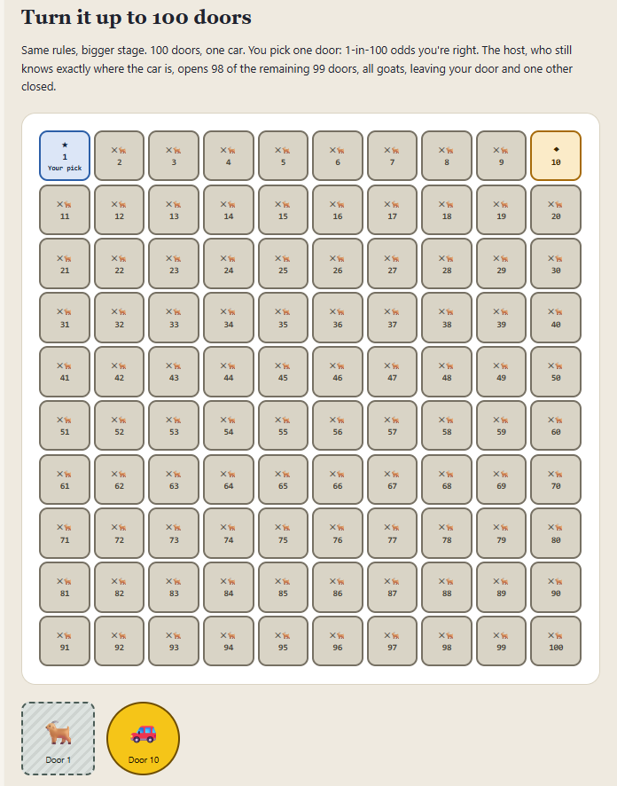

# Eight agents, one page, four green checks, still wrong

This repository is a **field report**, not a framework. One run of an
eight-agent Claude Code pipeline, with exclusive file ownership and four
scripted checks, used to build a Monty Hall explainer as the test article.

**Question:** what does a role-separated agent team with scripted checks
actually catch, and at what cost?

**What we measured:** cost, the shape of the failures, and what a PASS
from each check actually means.

**What we did not measure:** the single-session control. Nothing in this
repo tells you whether eight agents beat one. An independent review of the
repository concluded the approach, as implemented, is not worth its cost.
That review is published unedited in
[docs/EXTERNAL-REVIEW.md](docs/EXTERNAL-REVIEW.md).

The pipeline landed in one commit. There are no agent transcripts or
per-bug FAIL logs in this repository. The bug list is later prose,
written by the same process under study.

If you are here to design a different pipeline, skip this file and start at
[docs/LESSONS.md](docs/LESSONS.md). Wiring diagrams for *this* run:
[docs/PIPELINE.md](docs/PIPELINE.md). This README is the report of the run.

The explainer is at the
[live demo](https://gabriel-dg.github.io/multi-agent-pipeline-study/).
It exists so the process has something to be wrong about. It is not the
deliverable.

## What this run actually showed

- **A PASS is not a working page.** All four checks reported green. A
  human then opened the page and found four more defects, including
  a footer that leaked the host-knowledge rule before the first click.
- **The checks overlap, and one of them does not read the sentence it
  claims to verify.** `check-claims.js` compares a sibling `_assert` object
  to `sim.js`. A sentence can be edited into saying something else and the
  check still passes. Coverage is partial: 17 probability-stating strings
  carry no assertion at all.
- **The adversary was cheap and load-bearing.** skeptic consumed 3% of
  spend and produced the findings that rewrote the central argument,
  including a false general law and a dropped case in a three-case
  enumeration.
- **Coordination, not the specialists, is where the money went.** First
  full run: $31.81 API-equivalent. Named subagents account for 51% of
  reported usage. The other 49% is unattributed; the numbers are consistent
  with orchestrator context, and they do not split out the missing
  sim-engineer share. That 49% is a hypothesis the data permit, not a
  measurement of orchestrator overhead.
- **File ownership was a prompt until a hook existed, and the hook still
  cannot see a shell redirect.** math-verifier and qa-walker have Bash. A
  bypass is a policy failure, not enforcement.
- **The nine-bug list is later prose.** There are no skeptic reports, FAIL
  logs, or transcripts in this repository. Two of the nine were not
  pipeline catches on this README's own telling. The cost figure and the
  bug list describe different stretches of work.

## The specimen

The Monty Hall page is the test article this pipeline was pointed at, not
the product. Vanilla HTML/CSS/JS: clone and open `index.html`, or use the
[live demo](https://gabriel-dg.github.io/multi-agent-pipeline-study/).
Pedagogical spec in [`docs/SPEC.md`](docs/SPEC.md); strings in
`copy.json`. A banner on the live page says the same thing.

## Method

Eight agents, exclusive write access, no agent-to-agent channel. The
orchestrator routes every arrow. Writers run sequentially except where
files are disjoint; reviewers run in parallel. Author and verifier are
always separate. Roster and ownership:
[`docs/TEAM.md`](docs/TEAM.md). Sequence, gates, and round limits:
[`CLAUDE.md`](CLAUDE.md). Wiring diagrams:
[`docs/PIPELINE.md`](docs/PIPELINE.md). Agent files:
[`.claude/agents/`](.claude/agents/).

Monty Hall was the test case because its answer is settled by simulation,
so a disagreement can be decided by a script instead of an argument.

| agent | model | owns |
|---|---|---|
| [learning-designer](.claude/agents/learning-designer.md) | sonnet | `docs/SPEC.md`, `copy.json` |
| [art-director](.claude/agents/art-director.md) | sonnet | `tokens.css`, `docs/DESIGN.md` |
| [sim-engineer](.claude/agents/sim-engineer.md) | sonnet | `sim.js` |
| [math-verifier](.claude/agents/math-verifier.md) | haiku | `verification/*` |
| [ui-engineer](.claude/agents/ui-engineer.md) | sonnet | `index.html`, `viz.js` |
| [qa-walker](.claude/agents/qa-walker.md) | sonnet | `tools/qa-walk.js` |
| [skeptic](.claude/agents/skeptic.md) | opus | nothing (read-only) |
| [design-reviewer](.claude/agents/design-reviewer.md) | sonnet | nothing (read-only) |

## What the four checks actually check

Four checks, complementary, not independent. The external review was right
about that. Commands run from the repo root.

| check | command | what a PASS means | what it does not mean |
|---|---|---|---|
| Simulation | `node verification/test-sim.js` | empirical rates match closed form (3 doors: 1/3 vs 2/3; N doors: 1/N vs (N-1)/N; random host: ~1/3 spoil, else 50/50) | the page's *sentences* are true |
| Contrast | `node verification/check-contrast.js` | every pair *declared* in `DESIGN.md` meets WCAG and matches the claimed ratio | the page only renders declared pairs |
| Claims | `node verification/check-claims.js` | each `_assert` object matches `sim.js` within tolerance; no em dashes | the sentence next to the `_assert` says that number. 36 strings state a probability; 19 carry an assertion. The 17 gaps include every joint in both route tables. |
| Browser | `cd tools && npm install && node qa-walk.js` | the page loads, beats unlock in spec order, no leftover `{{placeholders}}`, rendered color pairs are in the ledger | the spec is complete. An ungated footer had no spec entry, so this check had nothing to fail. |

`check-claims.js` never parses the number in the sentence. A string can be
edited into saying something else and still PASS, as long as the sibling
`_assert` is untouched. `round100.mechanismCallout` tells the reader "1
time in 50"; its assertion is `prizeRevealed` expected 0.98, the
complement. Both are correct. A human has to know that.

## What the pipeline found

Count: one bug per defect in the shipped page or its spec that somebody
had to go back and fix. Nine below are what the pipeline's own agents and
checks surfaced; four in the next section are what it did not. There are
no transcripts, FAIL logs, or per-bug commits; the whole pipeline landed
in one commit. Two of the nine were not pipeline catches on this report's
own telling.

1. **False general law as proof.** "An event that was going to happen
   either way can't be evidence." False: a host who always opens the
   lower-numbered goat still always reveals a goat, and which door leaks
   information. skeptic, second pass.
2. **Dropped case in a three-case enumeration.** The third starting case
   was omitted, which reads like the counting trick the page exists to
   disprove. skeptic, third pass.
3. **Joints that summed to 1/2, not 1**, with no stated renormalization.
4. **Knowing vs random host asserted, not shown.** Fixed by adding a
   parallel route table.
5. **"Disproportionately" vs exact survivorship.** Spoiled rounds *are*
   the switch-win cases, not approximately. The README reported this
   fixed while `faq.items[2]` still said "disproportionately". The
   external review caught the leftover; no check here could have, because
   none reads the sentence.
6. **A design fix that dropped the requirement.** art-director proposed
   replacing a "host forbidden" badge with disabled-button styling.
   Catching it took a human reading the proposed fix. Not a pipeline
   catch.
7. **Lock/violet reused for a non-clickable door;** played vs spoiled
   distinguished by hue only.
8. **Undeclared color pair at render time**, twice. qa-walker, via
   `getComputedStyle`. Invisible to `check-contrast.js` and to a source
   read.
9. **Ten em dashes after a pass that reported zero.** Found by a manual
   grep from the orchestrator, which `CLAUDE.md` forbids. Not a pipeline
   catch. The style pass exists now because of this.

## What the pipeline missed

All four checks green. A human then walked the page.

- Footer never gated, so the host-knowledge rule and colophon rendered
  under the opening poll. Not in `SPEC.md`, so qa-walker had no entry.
- Ineligibility badge marked "not clickable" doors, not "host forbidden"
  doors, and contradicted the callout under it.
- Badge had no accessible name (`aria-hidden` icon, no text).
- Colophon URL was plain text, not a link.

Same shape as the bugs it did catch: a verifier checking a specification
that does not mention the thing. A later `## Visible at t=0` contract in
`SPEC.md`, checked bidirectionally by qa-walker, converts *an unlisted
rendered region* into a failure. It does not make the spec correct.

A report of verification work was wrong eight times in this run (seven
agent self-reports, one orchestrator). Examples: coverage counted 21 gaps
instead of 17; a route-arithmetic check passed the defect it was written
for, by set membership; a beat-to-spec check passed vacuously when it
parsed zero beats; an ownership-hook test was reported held when the hook
never fired. Each was caught by inspecting the artifact, not the report.

## The external review

An independent model checked every probability statement against Bayes
rather than against `sim.js`, ran the scripts, drove the live page as a
50/50 reader, and tested the experimental claims. Verdict: the approach
is not worth its cost as implemented. Unedited:
[docs/EXTERNAL-REVIEW.md](docs/EXTERNAL-REVIEW.md).

Fixed since: knowing-host Route 3 (wrong partition), "1/3 x 1 = 2 in 6",
Beat 1 announcing 2/3 before play, the 98-number dump, this README's
overclaim that every numeric claim is checked, the 49% figure presented
as a measurement, LESSONS/TEAM/SPEC contract drift, the missing
design-reviewer → art-director route, FAQ "disproportionately", a
specimen banner, and a colophon that no longer says every number is
checked.

Still open: overlapping checks; skeptic reads source, never the rendered
page; `check-claims.js` still does not parse sentences; ownership hook
cannot see a shell redirect; no transcripts for the nine bugs; no control
run; no recorded sabotage test; no runner (porting means rewriting eight
prompts); Beat 3's length; qa-walker's Beat 2 retry can fail a good page
(~1 run in 438); Beat 9 is the thinnest walker coverage on the page.

## What it cost

First end-to-end run only: spec through the first complete verification
pass, not later compression and design-review rounds. Claude Pro plan;
the dollar figure is API-equivalent, not what was billed.

- $31.81 API-equivalent. API time 2h 23m. Wall clock 17h 24m.
- 6,238 lines added, 514 removed.

| model | cost | share | input | output | cache read | cache write |
|---|---|---|---|---|---|---|
| Sonnet | $29.41 | 92% | 677.2k | 796.1k | 48.8m | 3.6m |
| Opus | $1.87 | 6% | 94.4k | 24.3k | 243.1k | 106.7k |
| Haiku | $0.53 | 2% | 10.6k | 39.2k | 984.3k | 179.8k |

Subagent share, as reported: learning-designer 16%, qa-walker 15%,
ui-engineer 9%, art-director 6%, skeptic 3%, design-reviewer 1%,
math-verifier 1%. Seven figures for eight agents; sim-engineer is
missing. They sum to 51%. 42% of usage happened at over 150k tokens of
context. Read the rest as a hypothesis the numbers permit, not as
measured orchestrator overhead.

A single well-prompted session would have built a comparable page for a
small fraction of that cost. The extra cost bought the bug list, not a
better-looking page.

## Limitations

Several times the cost of one session, not a marginal overhead. The work
has to split into files with one owner, and the claims have to be the
kind a script can fail. Taste, visual quality, and whether an abstraction
is right are out of scope; the pipeline checks correctness, not whether
`DESIGN.md` looks good or the prose is pleasant.

To run the *page*: open `index.html`, or the
[live demo](https://gabriel-dg.github.io/multi-agent-pipeline-study/).
To run the *checks*: Node.js (unpinned) and, for the browser walk,
`cd tools && npm install` (fallback: `npx playwright install chromium`).
There is no pipeline runner.

**Read next:** the roast,
[docs/EXTERNAL-REVIEW.md](docs/EXTERNAL-REVIEW.md); the playbook,
[docs/LESSONS.md](docs/LESSONS.md); the wiring diagrams,
[docs/PIPELINE.md](docs/PIPELINE.md); the pipeline definition,
[`CLAUDE.md`](CLAUDE.md).
