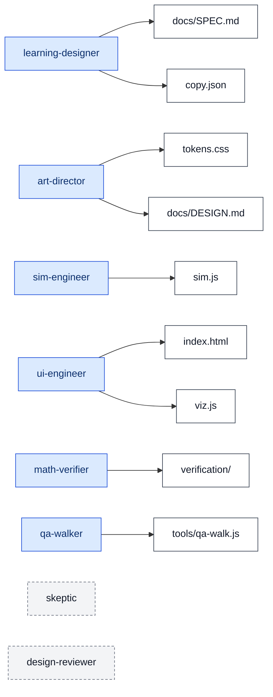
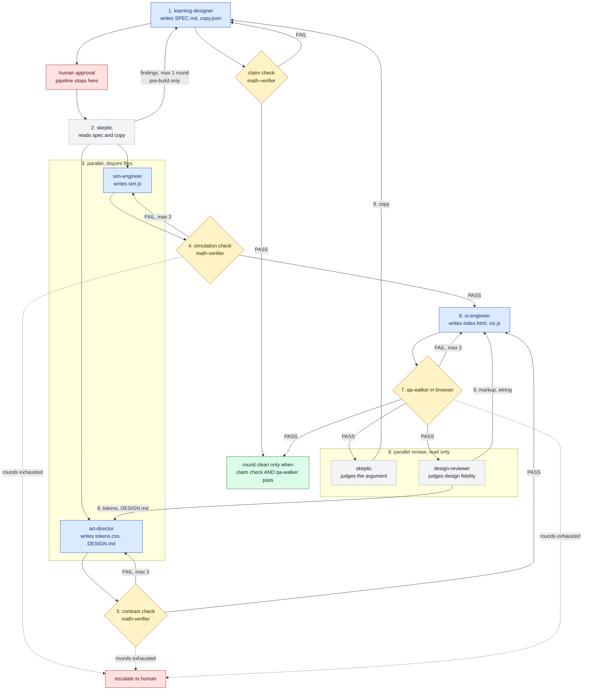

# Pipeline wiring (this run)

Human-facing map of the eight-agent pipeline that produced the Monty Hall
specimen. It is an illustration, not a contract.

If anything here disagrees with [`docs/TEAM.md`](TEAM.md) (ownership) or
[`CLAUDE.md`](../CLAUDE.md) (sequence, gates, round limits), those files
win. The playbook distilled from the run is
[`docs/LESSONS.md`](LESSONS.md), not this page.

## Ownership (writes only)

Solid arrows are exclusive write. Each product file has exactly one.
skeptic and design-reviewer write nothing. Reads are in the roster table
in [`docs/TEAM.md`](TEAM.md), not drawn here. Orchestrator-owned files
(README, CLAUDE.md, this page, and the rest of that row) are also omitted;
they are not part of the specimen.

`verification/` stands for every harness file math-verifier owns, including
the route-arithmetic checks listed in TEAM.md.

## Sequence

Agents have no channel to each other. Every arrow is the orchestrator
routing. Numbered steps, round limits, ownership checks after every writer
(step 10), and re-triggers (step 11) are in [`CLAUDE.md`](../CLAUDE.md).
This drawing skips 10 and 11 so the happy path stays readable.

Blue writes. Dashed grey is read-only. Yellow is a gate: that agent may not
edit the files it checks. Red is a human. After a review round, the round
is not clean until **both** the claim check and qa-walker have passed.

design-reviewer findings split by where the fix lands: markup and wiring to
ui-engineer; token values, missing tokens, and anything in `DESIGN.md` to
art-director. That split is drawn. A qa-walker ledger mismatch also splits
by cause; that rule is in CLAUDE.md step 9 and is not drawn.

